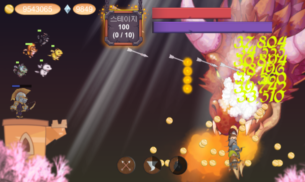
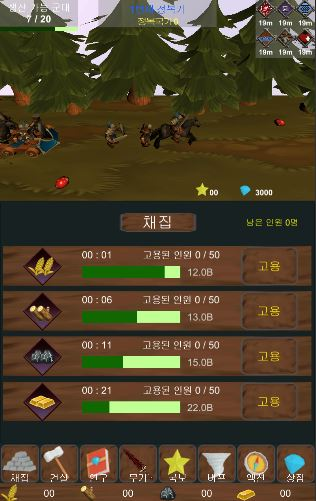
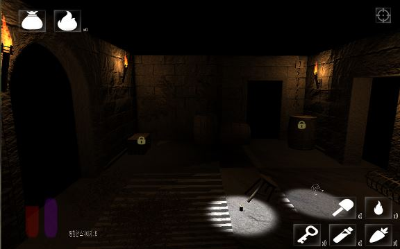
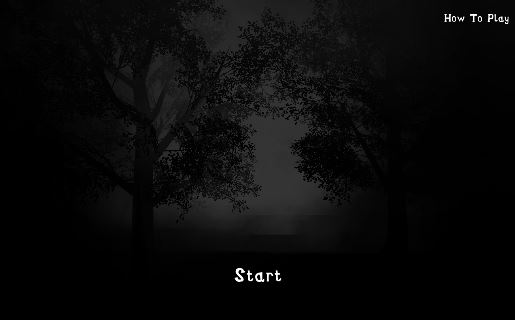

# 홍온유
## Introduction
C, C++, C#을 사용할 줄 알며, 유니티 3D를 이용해 1인 게임을 개발해 유니티 Ads 광고와 구글 인앱 결제를 연동하여 플레이 스토어에 올려본 경험이 있습니다.  전산학 지식, 알고리즘, 자료구조 및 유니티3D를 공부하며 역량을 키워가고 있는 게임 프로그래머 지망생입니다.
## Personal Experiences
### Game
- [3D RPG 기능 구현](https://github.com/zoqxlstm7/Unity3D-Portfolio/tree/master/3D%20RPG): 유니티3D를 이용하여 기본적인 RPG의 기능들을 구현
- [핵앤슬래시 장르 게임](https://github.com/zoqxlstm7/Unity3D-Portfolio/tree/master/Hack%20and%20Slash): 유니티3D를 이용한 핵앤슬래시 장르의 게임 개발
### Applications Program
- [통합 관리 프로그램](https://github.com/zoqxlstm7/Integrated-Management): 현장에서 사용되는 모든 장비 프로그램의 버전 업데이트 및 config 정보 수정, 프로그램 교체 용도로 쓰기 위해 Winform으로 제작
- [충돌방지 프로그램](https://github.com/zoqxlstm7/Collision-Prevention): 타워크레인의 충돌사고를 방지하기 위해 제작되었으며, 지자기/자이로센서와 지그비 모듈, 사운드 센서, processing을 사용하여 구현
- [소음 측정 프로그램](https://github.com/zoqxlstm7/Noise-Measurement): 소음 측정 센서를 이용하여 c#으로 구현되었으며, 소음 측정 프로그램에 시리얼 통신으로 LED 전광판을 연동하여 측정되는 소음이 전광판에 노출되도록 구현
- [활성 카메라 모니터링 프로그램](https://github.com/zoqxlstm7/Camera-Mornitoring): HIKVISION API와 WinForm을 활용하여 현재 동작하고 있는 CCTV 카메라의 활성상태를 실시간으로 보기 위해 제작된 프로그램
- [CCTV 카메라 녹화 프로그램](https://github.com/zoqxlstm7/Camera-Record): 라즈베리파이 환경에서 동작했으며, CCTV 카메라를 제어하는 프로그램의 녹화 기능을 c#과 VLC를 이용하여 구현.
- [카메라 등록 프로그램](https://github.com/zoqxlstm7/Camera-Register): HIKVISION API와 WinForm을 활용하여 CCTV 카메라가 활성화 중인지 인터넷 브라우저를 거치지않고 빠르게 확인하는 용도로 제작
- [알콜 측정기](https://github.com/zoqxlstm7/Alcohol-Measurement): 알콜 측정 센서와 c#으로 알콜 수치를 측정하는 기능을 구현
## Unity 3D
- [FirstWinger](https://github.com/zoqxlstm7/UnityStudy/tree/master/FirstWinger): 강의를 수강하며 정리해 본 멀티플레이 슈팅게임
- [Photon2](https://github.com/zoqxlstm7/UnityStudy/tree/master/Photon2): Photon2을 이용한 기본적인 네트워크 구성 학습
## 전공 관련 정리 문서
- [C# 키워드 정리](https://github.com/zoqxlstm7/CSharp_keyword): 자주 사용하지 않는 문법 표현이나 나중에 다시 보면 좋을 만한 C# 문법들을 정리
- [운영체제](https://github.com/zoqxlstm7/CS/tree/master/%EC%9A%B4%EC%98%81%EC%B2%B4%EC%A0%9C): 운영체제 관련 정리
### 스토어에 올려봤던 1인 개발 게임
#### [클리쳐(Clicher) - 플레이 영상](https://blog.naver.com/zoqxlstm6/221420434051)
</img>  
#### [킹덤 디펜스 - 플레이 영상](https://blog.naver.com/zoqxlstm6/221420431103)
</img>  
#### [무작정 던전헤메기 - 플레이 영상](https://blog.naver.com/zoqxlstm6/221420427223)
</img>  
#### [다크런 - 플레이 영상](https://blog.naver.com/zoqxlstm6/221420429175)
</img>

